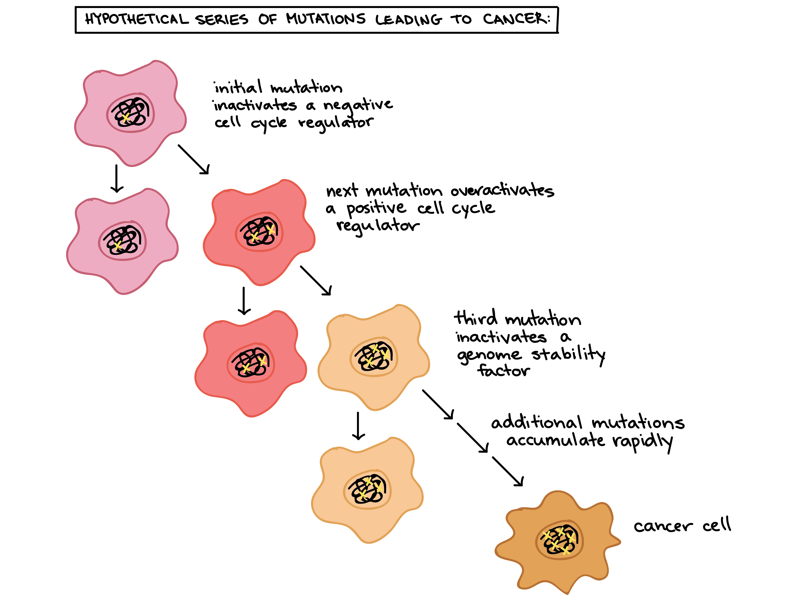

<link href="CustomSlidy.css" rel="stylesheet">

# Table of Contents

<table border = 0 width="60%">
<tr>
<td>
- Breast Cancer Data
- Cancer Cell Mitoses
- Numerical Variable Analysis
- Plot of Mitoses and Cell Thickness
- Regression Output
- Conclusions
- Output Reference

</td>
</tr>
</table>

# Breast Cancer Data 

<table border = 0 width="100%">
<tr>
<td> 
- The data used for this presentation was synthetic data 
- This data included 11 variables (10 numeric, 1 categorical)
- There was a total of 600 observations
- The variables used for this analysis were: 
  - Mitoses (cell growth) as the independent variable
  - Thickness of clump (thickness of the layers of the cells) as the dependent variable
- **This assessment had the aim of understanding if there is a relationship between mitoses (number of cell divisions) and thickness of cell clumps**
  

</td>
</tr>
</table>

# Cancer Cell Mitoses

<table border = 0 width="60%">
<tr>
<td> 
  

</td>
</tr>
</table>

# Numerical Variable Analysis

<table border = 1 class="rmdtable">
<tr>
<th>Variable</th><th> Mean</th>
</tr>
<tr>
<td> Mitoses</td>
<td>2.09 </td>
</tr>
<td> Cell Thickness</td>
<td>5.41 </td>
</table>
- The average participant in the study had cells undergo mitosis **2.09** times

- The average participant in the study had cells that were of **5.41** thickness

</td>
</tr>
</table>

# Plot of Mitoses and Cell Thickness 

<table border = 0 width="80%">
<tr>
<td> 
  

- As the number of cell divisions increases, there are less cells that have a small amount of layers. 

</td>
</tr>
</table>

# Regression Output

<table border = 0 width="100%">
<tr>
<td> 
  

- The p value for mitoses was highly significant at <0.0001. 
  - This indicates that cell division is related to cell thickness. The greater the cell division, the thicker the cells. 
  - Regression equation: $y=4.27157+X_{mitoses}0.54383$ (For each increase of cell mitoses, cell thickness is multiplied by 0.54)

</td>
</tr>
</table>

# Conclusions

<table border = 0 width="100%">
<tr>
<td> 
- For the synthetic breast cancer data, a simple linear regression was performed. 
- The independent variable, mitoses, was evaluated to see if increase/decrease of cell division impacted cell thickness (dependent variable)
- It was found that there was a strong relationship between mitoses and thickness, with a p value of <0.0001
  - Furthermore, it was found that with increased cell division, cells were thicker
  - Increased cell division and increased layers of cells are both related to a higher tendency for cells to not be benign 
- The final regression equation was:  $y=4.27157+X_{mitoses}0.54383$

</td>
</tr>
</table>

# Output Reference

<object data="https://isarenn.github.io/irennenberg/BreastCancerOutput.pdf" type="application/pdf" width="80%" height="430px">
      
Unable to display PDF file. <a href="https://isarenn.github.io/irennenberg/BreastCancerOutput.pdf">Download</a> instead.

    </object>

